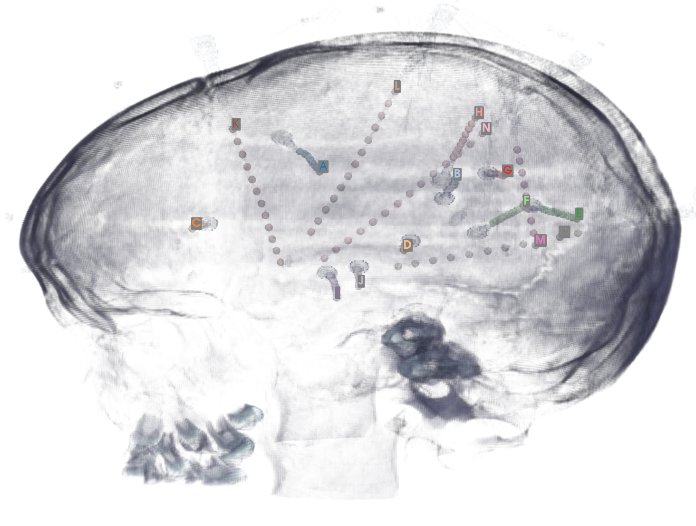
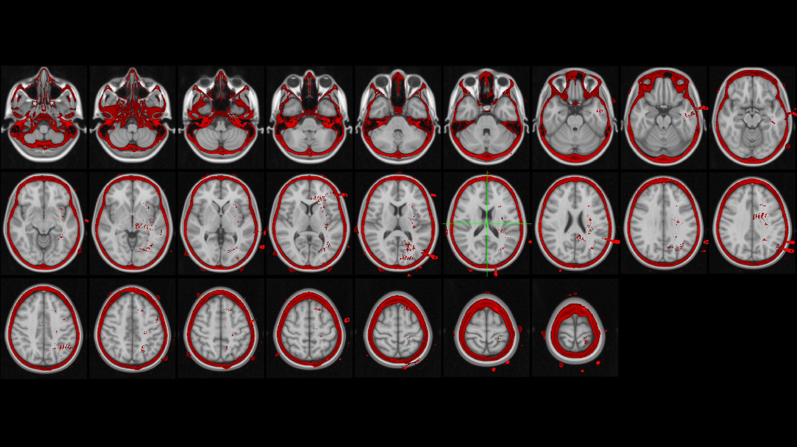

# Coregister post-insertion CT images for SEEG analysis
Simeon Wong  
Ibrahim Lab @ SickKids

Automatically mark electrode contacts in post-insertion CT imaging, roughly cluster into electrodes, then warp coordinates into standard MNI space.  

## Algorithms
- scipy label / regionprops for contact identification
- custom code for electrode clustering
- fsl flirt (linear coregistration) of CT <=> Subject MRI
- fsl fnirt (non-linear coregistration) of Subject MRI <=> MNI152 template

## Installation
- requires FMRIB Software Library (FSL)
- requires X Windows System with OpenGL (eg. direct desktop access or VirtualGL headless)

``` bash
pip install git+https://github.com/gmilab/seegloc
```

## Usage
``` bash
seegloc_coreg /path/to/ct.nii.gz /path/to/mri.nii.gz /path/to/subject/coreg_output_dir
seegloc_autolabel /path/to/subject/coreg_output_dir
```

## Outputs

#### Electrode coordinate table
| ename | x        | y        | z       | aal             | entry |
|-------|----------|----------|---------|-----------------|-------|
| A-01  | -43.3236 | 2.77232  | 40.8664 | Precentral_L    | FC3   |
| A-02  | -38.8153 | 2.01561  | 38.612  | Precentral_L    | FC3   |
| A-03  | -34.0798 | 1.52495  | 36.5061 | Precentral_L    | FC3   |
| A-04  | -28.3241 | 0.982843 | 34.7693 | Frontal_Mid_2_L | FC3   |
| A-05  | -19.7692 | -1.11625 | 33.8938 | Cingulate_Mid_L | FC3   |

#### 3D rendering of labelled electrodes


#### Coregistration QC image (CT overlaid on MRI template)



## Troubleshooting
#### Manual transforms
Automatic electrode segmentation from CT may not always work in some cases where individual electrodes are not easily identified (eg. electrode is so bright there is no space between electrode contacts).  
In this case:
1. Using CT viewing software (eg. `fsleyes`), note the CT scanner-space coordinates in mm of:
    1. The tip (deepest contact) of the electrode trajectory
    1. Any other point along the trajectory
1. Run the `seegloc_extrapolate` command:
```bash
seegloc_extrapolate [spacing in mm] [number of contacts] [tip_x] [tip_y] [tip_z] [other_x] [other_y] [other_z] --coreg /path/to/subject/coreg_output_dir
```
